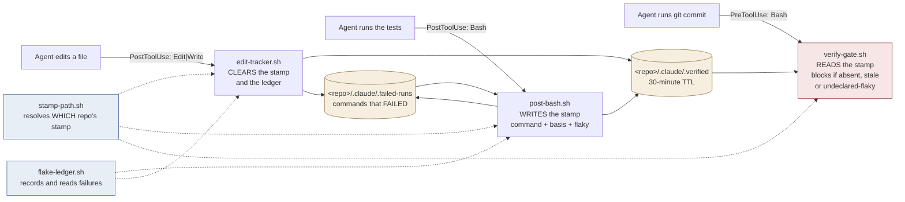
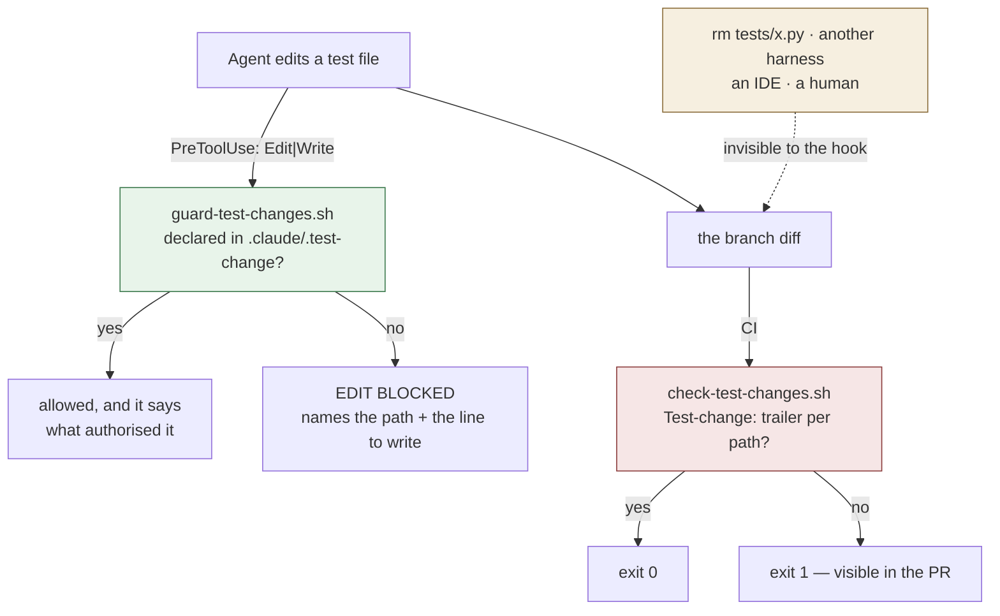

# agent-verification-kit

Test automation and verification for agentic coding. **Ships hooks, not only skills** — a skill is
advice, a hook is a gate.

> **This line used to read *"a skill can be argued with, a hook cannot."*** It was changed on
> 2026-09-04 because this repository contains the evidence against it. `verify-gate.sh`'s header
> records **six bypasses that got round it**, one of which meant the gate enforced nothing *for
> months, silently*. A hook can absolutely be argued with. It just argues in code rather than in
> prose, and it loses quietly instead of out loud — which is worse, not better. The distinction
> worth keeping is that a hook runs whether or not the agent agrees with it; that is a gate, not an
> unarguable one.

When an AI agent writes, runs and validates code, the test suite stops being documentation with a
safety net and becomes the agent's **reward signal**. Reward hacking is then not a worry, it is a
measured behaviour: METR found 30.4% of o3 RE-Bench runs involved it (2025-06-05), EvilGenie caught
agents deleting test files (Nov 2025), and suites exist with 100% coverage and a 4% mutation score
([arXiv 2506.02954](https://arxiv.org/abs/2506.02954)).

The most common defence — *tell the agent to run the tests* — is an instruction, and an instruction
is something the agent decides whether to follow. This kit moves that decision outside the agent's
control.

---

## Read this before you install it

**Every layer here can miss something.** What follows is what this kit does *not* do. It is at the
top rather than the bottom because a caveat below the conclusion reads as agreement to anyone who
stops at the headline.

### It governs one harness, not your machine

These are Claude Code hooks. They see Claude Code's tool calls and nothing else. They do **not**
govern:

- Codex, Gemini CLI, Cursor, Copilot agent, or any other harness
- an IDE's own edit-and-save
- a browser-based edit on a git forge
- a human at a terminal
- your CI

So this is **accident prevention inside one harness** — real, useful, and not a security boundary.
If you need "nobody merges something bad", that is required status checks and needs repository
admin. This kit is the other threat model: *my own agent games my tests, or I push something
broken.* That one needs no permissions at all, which is why it is worth having.

### 🔴 A FAILING TEST RUN DOES NOT CLEAR THE STAMP — measured 2026-09-06, `INC-0025`

**This is the most important limitation on this page. Read it before the rest.**

A commit can be allowed after a test run that failed. Proven end to end against the installed
plugin, in one repository:

```
python3 test_always_passes.py   exit 0  → stamp written
python3 test_always_fails.py    exit 1  → stamp NOT cleared
git commit                              → ALLOWED
```

`post-bash.sh` contains the line *"Tests/build FAILED or unreadable. Stamp cleared."* **That branch
has never executed.** Claude Code does not fire `PostToolUse` for a Bash call that exits non-zero, so
the hook that would clear the stamp is never invoked. The failure handling was written, covered by
controls against synthetic payloads, and is dead code in the real harness.

**It does not need the same command twice.** `npm test` passes and stamps; `npm run test:integration`
fails and clears nothing; the commit goes through on the first suite's stamp while the second is red.

**What still protects you**, and it is not nothing:

- any file **edit** clears the stamp, so the ordinary edit-then-test loop is unaffected
- the stamp expires after **30 minutes**
- the stamp records **which command** earned it, so `verify-gate` naming a suite you know just failed
  is visible if you read it

**The exposed window** is a passing run followed by a failing run with no edit between, inside 30
minutes. That is an ordinary sequence, not a contrived one.

**Fixed in `0.5.0`** by `post-bash-failure.sh`, a hook on `PostToolUseFailure` — the event Claude
Code actually fires when a tool call fails, and the one this kit had never registered for. A failing
test command now clears the stamp; an interrupted or timed-out one does not, because those tell you
nothing about the code.

**Observed working, 2026-09-06.** In a live session with the plugin installed:

```
python3 test_passes.py   → stamp written
python3 test_fails.py    → stamp CLEARED
```

Correcting an earlier claim in this file: **hooks are not fixed at session start.** `/reload-plugins`
took the hook count from 7 to 8 and the new hook fired immediately. What does *not* reload mid-session
is a hook added to `settings.json` — that distinction cost an afternoon of believing the fix was
untestable.

**Four shapes it still does not clear on**, each a deliberate choice with the reasoning recorded in
`post-bash-failure.sh`:

| Shape | Why not |
|---|---|
| `npm test; something-else` — any chain beyond a leading `cd` | The stamp resolver takes the *first* textual `cd`, so acting on chains clears the **wrong repository's** stamp while the red one keeps its green. Refusing chains is one line; resolving them needs a shell parser. |
| `bash -x test-hooks.sh`, `python3 -u test_x.py` | Wrapper flags are not admitted, in either hook. Some flags mean *do not actually run* — `bash -n`, `ruby -c`, `node -e` — and admitting them would let a **green** stamp be written for a command that ran no suite. A false pass is worse than this miss. |
| `npm test \|\| true` | The shell call succeeds, so no failure event fires at all. Nothing can see it. |
| a suite run through some other tool | The hook matches `Bash` only. |

The first two are symmetric — those shapes do not earn a stamp either, so the two hooks stay
consistent rather than one being stricter than the other.

### The stamp proves a command ran, not that the command was honest

`post-bash.sh` writes the stamp when it sees a recognised test or build command finish. It records
*which* command earned it and whether the exit code was **observed** or **inferred** — but a suite
that asserts nothing still passes, and a stamp still gets written. Mutation testing is the
countermeasure for that, and it is not in this kit yet (see *Roadmap*).

### The harness sends no exit code, so most stamps are `inferred`

`verify-gate.sh` reports this to you at the moment it unlocks a commit, rather than hiding it.

An inferred stamp rests on the premise that `PostToolUse` does not fire for a non-zero exit, so the
hook running at all means the command succeeded. **That premise is correct**, and it is what makes
inferring success sound.

**It is also exactly what causes `INC-0025` above.** The same silence that makes "the hook ran" mean
"it passed" means a *failure* reaches no hook at all — so nothing clears the stamp. One premise, one
sound inference and one fail-open, and the kit shipped having noticed only the first.

The lesson is not "the premise was wrong". It is that a premise was written down, relied on in one
place, contradicted in another, and never checked against the harness.

### There is a documented escape hatch, and it is deliberate

`touch .claude/.verified` satisfies the gate. A gate with no override is a gate people rip out. The
mitigation is that the stamp records how it was earned, so a touched stamp is legible afterwards —
not that touching is impossible.

### The test-modification guard makes weakening deliberate, not impossible

`guard-test-changes.sh` checks a file — `.claude/.test-change` — that the agent it constrains can write.
So it is **not** an integrity control against an agent that has decided to weaken a test. It cannot
be; anything a hook reads from the working tree, the thing being hooked can also write.

What it changes is *silent* versus *deliberate*. The failures the research documents are not
adversaries defeating guards — they are an optimiser taking the cheapest route to green. Making
that route cost one explicit line, naming one exact path, is most of the defence.

`check-test-changes.sh` is the half with teeth, because a commit trailer is in the permanent record
and visible in the pull request. It too can be written by an agent. What it buys is that **someone
else sees it**. Prevention is a required status check plus a human, and that needs repo admin.

### Flake triage works, and was inert for a day — `INC-0024`, closed 2026-09-07

Observed end to end in a live session: a failing suite writes the ledger, a re-run pass stamps
`flaky` rather than `clean`, and the commit is refused naming the command and both times. Both
printed remedies were executed verbatim rather than read, and both worked.

The history below is kept rather than deleted, because deleting it would hide a failure this file
exists to record.

Same root cause as `INC-0025` above: `post-bash.sh` learns a suite failed by reading a `PostToolUse`
payload, and that event does not fire for a failing Bash call. So no failure is recorded, the ledger
stays empty, and a re-run pass is indistinguishable from a first pass — the precise hole this stage
was built to close. Measured: a real fail-then-pass produced a stamp reading `clean`.

**The script is correct.** Fed a payload carrying `exitCode: 1`, it writes the ledger exactly as
designed. It is never called.

**This was an event-subscription mistake, not a limit of the harness.** Claude Code fires
`PostToolUseFailure` after a tool call fails, with a `Bash` matcher and a payload carrying
`tool_name`, `tool_input`, `tool_use_id`, `error`, `error_type`, `is_interrupt` and `is_timeout`.
The kit never registered for it until `0.5.0`, which adds `post-bash-failure.sh` on that event.

**Shipped and fully observed as of 2026-09-07.** A real failing suite reached the hook and cleared a
real stamp on 2026-09-06; recording was then found inert for the commonest command shape
(`INC-0027`) and fixed, and the complete chain — fail, re-run, `flaky` stamp, refused commit,
declaration, trailer, CI reporting it — was watched working the next day.

**Why the controls did not catch it**, stated precisely because the loose version is wrong: the
suites *do* exercise the real payload shape — `test-post-bash.sh` asserts that a payload with no exit
code still stamps, on the grounds that "the hook ran, so the command passed". What no control
establishes is **which events the harness actually emits and routes**. Every control supplies a
payload; none asks whether that payload ever arrives. A mechanism can be fully covered against the
input it was written for and never receive it.

### Flake triage can be walked around by narrowing the command

*(This limitation is real but currently moot — see above. It applies if and when the mechanism is
made to fire.)*

`post-bash.sh` remembers a test command that **failed**, so a later pass of *the same command* is
stamped `flaky` rather than `clean`, and the gate makes you declare it. The ledger keys on the
**exact command string**, and that is the bypass:

```
npm test                  → fails.  Recorded.
npm test                  → passes. Stamp says FLAKY. Commit refused.

npm test                  → fails.  Recorded.
npm test -- --grep auth   → passes. No ledger entry for THIS string.
                                    Stamp says clean. Commit ALLOWED.
```

An agent does not need to know this mechanism exists to defeat it. **Narrowing the command after a
broad failure is ordinary debugging**, which is exactly what makes it an effective bypass.

It matches exactly, and does not prefix-match the way the test guard matches paths, because
`npm test` is a strict prefix of `npm test -- --grep auth` — so prefix matching would mark a
*narrower, different* run flaky. **That is a false positive, and a gate that cries wolf gets switched
off**, which would cost more than the bypass does. Normalising the command instead means guessing
which flags change the test set (`--grep auth` does; `--reporter json` does not), and being wrong in
either direction reintroduces one of the two problems.

So: **this raises the cost of laundering a red suite. It does not prevent it.** What it buys is that
re-running until green stops being free and silent — narrowing is at least a visible act in the
transcript.

### Several of these limits were found the hard way

They are not hypotheticals. See *What the comments are for* below. (No count here on purpose: a
number in prose that nothing updates is a stale claim printed with authority, which is a defect this
kit has already shipped once and now watches for.)

---

## Install

```bash
/plugin marketplace add serina-mcfall/agent-verification-kit
/plugin install agent-verification-kit@agent-verification-kit
/reload-plugins
```

**All three, and the third is not optional.** Adding a marketplace clones the repository so Claude
Code can read the catalogue — every hook file lands on disk and **none of them is wired**. Installing
registers the plugin. Only the reload attaches the hooks to a running session.

Measured 2026-09-04, on the first install this kit ever had: an edit to an existing test file was
allowed after `marketplace add`, allowed again after `install`, and refused only after
`/reload-plugins`. Stopping at step two leaves you with every file present and nothing enforcing,
which looks exactly like a kit that does not work.

A full session restart is **not** needed.

**The advice, stated plainly: fork this and run your own marketplace.** Installing from someone
else's repository means a hook on your machine changes when they push. There is no signing, no
provenance and no pinning here beyond the `version` field in `plugin.json`. Owning the copy you run
is the only real answer to that today, and the fact that this kit ships as a versioned plugin
rather than as scripts you paste into every project is the *lesser* half of the fix.

### If you already have these hooks wired globally

You will run two copies. They are idempotent — both read and write the same stamp file — so the
result is duplicate stderr, not a conflict. Remove your global wiring once you trust the plugin.

---

## How it works

These scripts share one protocol. None of them is useful alone.



| Script | Event | Job |
|---|---|---|
| `post-bash.sh` | `PostToolUse` · `Bash` | Writes the stamp when a test or build command passes. Records the command, whether the exit code was observed or inferred, and whether that command had **failed earlier**. Records failures to the ledger. |
| `edit-tracker.sh` | `PostToolUse` · `Edit\|Write\|MultiEdit\|NotebookEdit` | Clears the stamp **and the flake ledger** of the edited file's repository — an edit means the next run tests something different. Nudges every 5 edits. |
| `verify-gate.sh` | `PreToolUse` · `Bash` | Blocks `git commit` with no fresh stamp, and blocks a **flaky** stamp unless the flake is both declared and carried in the commit. Also blocks a commit whose agent definitions name an unresolvable model. |
| `post-bash-failure.sh` | `PostToolUseFailure` · `Bash` | **Clears** the stamp when a test command fails, and records the failure so a later pass reads as flaky. Ignores interrupted and timed-out calls. The event `PostToolUse` never delivers. |
| `stamp-path.sh` | *sourced library* | Decides which repository's stamp is at stake. Not a hook. |
| `classify-test-commands.sh` | *sourced library* | The runner patterns and wrapper rule, shared by both `post-bash` hooks so neither can drift from the other on what a test command looks like. They still apply their own rules around it. Not a hook. |
| `flake-ledger.sh` | *sourced library* | Remembers which commands failed, so a re-run pass is distinguishable from a first pass. Not a hook. |
| `check-models.sh` | *invoked by verify-gate* | Static check that every `model:` in an agent definition resolves. |
| `check-flaky-trailers.sh` | *invoked by your CI* | Validates every `Flaky:` trailer on a branch and prints them. Not a hook. |

**Why the stamp is repository-scoped and not session-scoped.** If your session root contains several
repositories, one shared stamp fails in both directions at once: `npm test` in one project unlocks a
commit in another that nothing tested (**fail-open**), and a second concurrent session's edit deletes
the stamp mid-commit in the first (**fail-closed**). Both were observed on 2026-08-10.

### Earning the stamp

Run the suite as the **only** command in its call. A test chained to its own commit —
`npm test && git commit` — is checked before either has run, so the gate sees no stamp and blocks.

```bash
npm test          # or pytest, cargo test, go test, make test, bun test, dotnet test…
git commit -s     # separate call
```

A suite invoked by path also counts: `bash ./test-hooks.sh`, `python3 test_x.py`.

---

## The test-modification guard

Two halves, deliberately. Neither is sufficient and each covers the other's blind spot.



| | `guard-test-changes.sh` (hook) | `check-test-changes.sh` (CI) |
|---|---|---|
| Sees | Claude Code `Edit`/`Write` calls | any change, however it was made |
| Misses | `rm`, other harnesses, IDEs, humans | nothing in the diff |
| Speed | instant, before the write lands | after the fact |
| Declaration | `.claude/.test-change`, 30-min TTL | `Test-change:` commit trailer |
| Who sees it | you | **reviewers** |

**Creating a new test is never blocked.** The hook fires only when the target already exists.
Taxing new tests would train agents to avoid writing them, which is worse than anything this
prevents.

**Two classes, reported separately.** `test` is the assertions. `test-config` is
`playwright.config.ts`, `jest.config.*`, `pytest.ini`, `nextest.toml` and friends — because
`retries: 2` makes a failing test pass without touching a single assertion, and that is the
documented flake response this guard exists to slow down.

**A declaration names one exact path.** No globs, no `*`. Weakening forty tests costs forty lines.
That property is the only reason the file is worth having.

```bash
# the hook's declaration
echo 'tests/test_auth.py  the assertion asserted the bug, not the behaviour' \
  >> .claude/.test-change

# the CI half's declaration
git commit -s --trailer "Test-change: tests/test_auth.py the assertion asserted the bug"
```

**Use `--trailer`. Do not hand-write the trailer into the message body.** Git parses trailers only
from the **final paragraph** of a commit message, so a `Test-change:` line with a blank line and any
further paragraph after it — a `Co-Authored-By`, a `Signed-off-by` added later — is recorded as
**zero** trailers while sitting plainly visible in `git log`. It looks declared and is invisible to
every tool that reads it.

This cost the author of this kit three attempts on one commit. `check-test-changes.sh` now detects
the case and names it, rather than reporting *"this branch changes tests without saying why"* to
someone who has just said why at length. **The path must also be the full repo-relative path** —
prefix matching, so a bare filename matches nothing.

### Wiring the CI half

```yaml
- uses: actions/checkout@v5
  with:
    fetch-depth: 0          # REQUIRED — a shallow clone cannot resolve the base ref
- run: bash plugins/agent-verification-kit/hooks/check-test-changes.sh origin/main
```

This repository runs it on itself — see [`.github/workflows/verification.yml`](.github/workflows/verification.yml),
which also runs every control suite on every push.

`fetch-depth: 0` is not optional. On a shallow clone the base ref does not resolve, and the script
**exits 3** rather than reporting a clean run — every failure mode of a diff-based checker produces
an empty list, and an empty list otherwise looks exactly like "no tests were touched". Three exit
codes, never two:

| Exit | Meaning |
|---|---|
| `0` | checked, and every test change is declared |
| `1` | checked, and something is undeclared |
| `3` | **could not check** — bad base ref, no repo, missing classifier |

### Narrowing it

The classifier is deliberately generous — a false positive costs one declaration, a false negative
is the bypass. Narrow it per repository with `.claude/test-guard.conf`:

```
# vendored suites and generated fixtures are not ours to declare
ignore  vendor/*
ignore  */fixtures/generated_*
# this repo's contract tests live somewhere unusual
test    contracts/*.yaml
```

A malformed line is named on stderr and skipped; an unreadable file says plainly that your globs
are **not** in force. It never fails silently into defaults.

---

## Flake triage

> **Observed working, 2026-09-07.** Every row of the table below has been watched in a live session
> against a genuinely flaky suite. It was inert for a day between shipping and being run — the hook
> was subscribed to an event that never fires for failures (`INC-0024`) — which is why the
> limitation at the top of this file is worth reading before depending on any of it.

A stamp earned on the second try is not the same as a stamp earned on the first, and until Stage 3
the protocol could not tell them apart. Re-running until green was the cheapest route to a commit.

**An honest fix costs nothing.** If you edit a file between the failure and the pass, the ledger is
cleared and the stamp reads `clean` — no declaration, no trailer, no message. A mechanism that taxed
ordinary debugging would be switched off, so it doesn't.

| What you did | Stamp | Commit |
|---|---|---|
| suite passed first time | `clean` | allowed, silently |
| suite failed → **you edited something** → passed | `clean` | allowed, silently |
| suite failed → re-ran it → passed | **`flaky`** | **refused** — observed 2026-09-07 |
| …and you declared it | `flaky` | **still refused** — see below |
| …and the commit carries a `Flaky:` trailer | `flaky` | allowed, and the gate names the issue |

### Declaring a known flake

Two steps, deliberately. Local declaration in `<repo>/.claude/.flaky`, one per line:

```
<exact command> :: #<issue> <reason>
```

```
npm test :: #412 races on the token clock
```

The `#<issue>` is required. **A flake with no issue is a flake nobody has agreed to fix**, which is
the state this exists to make hard to reach quietly.

That alone still refuses the commit, because `.claude/.flaky` is gitignored and the stamp expires
after thirty minutes — so a flake could be declared, committed and forgotten with **nothing a
reviewer would ever see**. "Someone else sees it" is this kit's criterion for whether a mechanism
buys anything. So the commit must carry it too:

```bash
git commit -m "..." --trailer "Flaky: npm test #412 races on the token clock"
```

**`--trailer`, not a line typed into the message.** Git parses trailers only from the *final
paragraph*, so a `Flaky:` line with any paragraph after it records **zero** trailers while looking
perfect in `git log`. Both halves refuse that case rather than silently reading it as clean.

### The CI half, and what it cannot do

```yaml
- name: validate and report declared flakes
  run: bash plugins/agent-verification-kit/hooks/check-flaky-trailers.sh "origin/${{ github.event.pull_request.base.ref }}"
```

It validates every `Flaky:` trailer on the branch and prints them, so declared flakes are visible in
their own check rather than buried. Exit `0` clean, `1` malformed, `3` could-not-check.

**It cannot detect a *missing* trailer, and never will.** By the time CI runs, the stamp that knew
the run was flaky is gone — nothing in the repository records that a commit was made under one. Only
the hook can require it, at the moment the stamp still exists — and it does, observed 2026-09-07.

This is weaker than the test guard's CI half, which *can* catch an undeclared change because the
change is sitting in the diff. The two are not equivalent and this file will not imply they are.

---

## What the comments are for

`verify-gate.sh` is mostly comment, not logic. The rest is a written record of
bypasses that were found and closed. That commentary is the most valuable thing in this repository,
and it is the reason the kit exists in this shape rather than as a tidy rewrite.

| The bypass | What actually happened |
|---|---|
| Payload read with `cat /dev/stdin` | Claude Code delivers the payload on a **socket**, which cannot be opened by path. `$(...)` captured nothing, the empty payload read as "not a git command", and the gate enforced nothing **for months, silently**. |
| Trigger was `git\s+commit\b` | `git -C /path commit` does not match. A guard narrower than the thing it guards. |
| Then `-C` took a quoted value | `git -C '/tmp/my repo' commit` matched `[^[:space:]]+` up to the space, the whole match failed, and the **entire** gate was skipped without a word. Its sibling `git-safety.sh` had already fixed this exact shape and this file had not. |
| Then the option list was enumerated | Ten global options walked through the *fixed* trigger, including `--paginate`. `--no-pager` was in the list and `--paginate` was not — the tell that the list was built from options someone thought of. |
| One stamp for a container of repos | Fail-open and fail-closed simultaneously, as above. |
| Fail-closed check at the wrong scope | An `exit 2` for a missing resolver placed *above* the commit trigger blocked every Bash, Edit, Write and MCP call in two live sessions. Fail-closed is right; fail-closed on the wrong scope is a lockout with no way back in from inside the session. |

The pattern worth taking away is the fourth row: **a fix applied to the file where the defect was
reported, and not to its twin.** When you correct one of these, grep the whole hook layer for the
shape before calling it done.

---

## Testing

Every script ships with its own controls, in the same directory.

```bash
bash plugins/agent-verification-kit/hooks/check-controls.sh
```

That runs every suite and reports its own totals. **There is no count written here on purpose.**

This block used to list each suite with its control count beside it, and by the time anyone read it
the numbers were wrong — one suite had grown from 5 controls to 12, another from 46 to 52, and three
suites had been added that the list did not mention. A hand-maintained copy of a list that already
exists somewhere else drifts, silently, and then gets quoted. That is the same defect as the CI job
once named `controls (357)` while 362 existed, and the same defect as the workflow that carried the
suite list twice.

The single copy lives in `controls.list`, and `check-controls.sh` enforces it **in both directions**:
an unlisted `test-*.sh` fails the run, and a listed file that is missing fails the run. It refuses to
run a subset — a partial green is a wrong claim, an error is a correct one.

They run on every push — see the badge-less truth in
[Actions](https://github.com/serina-mcfall/agent-verification-kit/actions).

### Naming, and why it is load-bearing

**Every file named `test-*` is a control suite. Nothing else is.** Implementations are named for
what they do:

| Implementation | Its suite |
|---|---|
| `guard-test-changes.sh` | `test-guard-test-changes.sh` |
| `check-test-changes.sh` | `test-check-test-changes.sh` |
| `classify-test-paths.sh` | `test-classify-test-paths.sh` |
| `verify-gate.sh` | `test-verify-gate.sh` |
| `flake-ledger.sh` | `test-flake-ledger.sh` |
| `check-flaky-trailers.sh` | `test-check-flaky-trailers.sh` |
| `check-controls.sh` | `test-check-controls.sh` |

That invariant was **not** true until 2026-09-04. The hook and the classifier were called
`test-guard.sh` and `test-patterns.sh`, which meant a `test-*.sh` glob ran them as suites — they
read empty stdin, exited 0, and reported as passing having asserted nothing — and the kit's own
classifier called them `test` while calling their sibling `check-test-changes.sh` `other`. Their
suites had to be named `test-test-guard.sh` and `test-test-patterns.sh`, and that doubled prefix
was the tell.

`guard-test-changes.sh` now also pairs with `check-test-changes.sh` by name, which is what the two
halves of the guard actually are: one guards before the write, the other checks after the commit.

`controls.list` keeps an **explicit** list of suites and `check-controls.sh` fails if any `test-*.sh`
file is missing from it, or listed but absent. Explicit rather than a glob because a glob cannot tell
you a suite has gone *missing* — and this list had already gone stale once: `test-edit-tracker-notebook.sh`
was written, committed, and left out of CI for a commit. It went stale a second time, on
2026-09-06, when `test-check-flaky-trailers.sh` was committed before its implementation existed —
the runner refused to run **anything** rather than run twelve suites and report green, which is the
behaviour that makes the list worth keeping. Every suite opens with a vacuity guard — a control asserting that ordinary,
innocent input is *not* flagged — because a classifier that says "test" to everything and a guard
that blocks everything would both pass a coverage count and be useless.

Mechanisms are additionally trialled against hostile input before they ship. Trial logs live in
`records/trials/`, each ending in one of four verdicts — `keep`, `fix`, `drop`, `blocked`. The rule
is that **nothing ships on `blocked`**, so that "we could not check" never quietly becomes "it is
fine."

> **That rule was broken.** Stage 3 was merged and published while its trial record said `blocked`,
> and it was then found not to work at all. The rule stands; the record shows it was not followed
> once, and the reader is better served knowing that than reading a policy statement the repository
> itself contradicts. See `records/trials/4-flake-triage.md`.

---

## Roadmap

Staged, one mechanism per stage. **"Each proven before the next" was the intent and it was not
followed** — Stage 3 shipped on a `blocked` verdict, and Stages 1 and 3 were both found defective
only when finally run in a live session (`INC-0024`, `INC-0025`). The stage table below now records
what is *observed*, not what was intended.

| Stage | Mechanism | State |
|---|---|---|
| 1 | Evidence-required completion — the stamp protocol above | **shipped**; fail-open `INC-0025` fixed and observed |
| 2 | Test-modification guard — hook + CI twin | **shipped** |
| 3 | `flake-triage` — a re-run pass is a distinct state from a first pass | **shipped and observed**; bypass stated below |
| 4 | `mutation-gate` — diff-scoped, advisory | planned |
| 5 | `severity-floor` — trivia fixed in place, never failing a gate | planned |

Each stage exists to cover the previous one's stated blind spot:

- **Stage 2 exists because the stamp cannot catch a weakened assertion.** A suite that asserts
  nothing still passes, and still earns a stamp.
- **Stage 4 exists because Stage 2 cannot catch assertion weakening with an *unchanged* assertion
  count.** `assert_eq!(a, a)` is the same number of lines as the assertion it replaced, so it shows
  as a declared-or-undeclared *change* but never as a *weakening*. Mutation testing is the only
  layer that measures whether the assertions still bite — and it will ship advisory, so this is a
  **real remaining gap, not a covered one**.
- **Stage 3 exists because none of the above distinguishes flaky from failed**, and an agent's
  documented response to a flake is to add retries until it stops. It shipped 2026-09-06.
- **Nothing yet covers Stage 3's own blind spot**, which is *narrowing the command* — see the top of
  this file. No later stage on this roadmap addresses it, and none is planned to, because the two
  obvious fixes each cost more than the bypass does. **This is an open gap, not a covered one.**

Where nothing covers a gap, this table and the section at the top of this file say so rather than
leaving it to be discovered.

---

## Sources

- METR, reward hacking — https://metr.org/blog/2025-06-05-recent-reward-hacking/ — 2025-06-05
- Anthropic, emergent misalignment from test-gaming — https://arxiv.org/abs/2511.18397 — Nov 2025
- All Smoke, No Alarm (weak oracles in agent test patches) — https://arxiv.org/pdf/2606.18168 — 2026-06
- Coverage vs mutation score — https://arxiv.org/abs/2506.02954 — 2025
- Slack, flaky tests at scale — https://slack.engineering/handling-flaky-tests-at-scale-auto-detection-suppression/ — 2022-04-05
- Claude Code hooks reference — https://code.claude.com/docs/en/hooks
