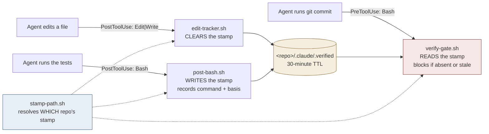
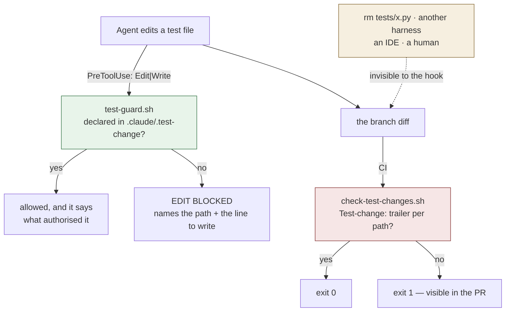

# agent-verification-kit

Test automation and verification for agentic coding. **Ships hooks, not only skills** — a skill
can be argued with, a hook cannot.

When an AI agent writes, runs and validates code, the test suite stops being documentation with a
safety net and becomes the agent's **reward signal**. Reward hacking is then not a worry, it is a
measured behaviour: METR found 30.4% of o3 RE-Bench runs involved it (2025-06-05), EvilGenie caught
agents deleting test files (Nov 2025), and suites exist with 100% coverage and a 4% mutation score
([arXiv 2506.02954](https://arxiv.org/abs/2506.02954)).

The most common defence — *tell the agent to run the tests* — is an instruction, and an instruction
is something the agent decides whether to follow. This kit moves that decision outside the agent's
control.

---

## Read this before you install it

**Every layer here can miss something.** What follows is what this kit does *not* do. It is at the
top rather than the bottom because a caveat below the conclusion reads as agreement to anyone who
stops at the headline.

### It governs one harness, not your machine

These are Claude Code hooks. They see Claude Code's tool calls and nothing else. They do **not**
govern:

- Codex, Gemini CLI, Cursor, Copilot agent, or any other harness
- an IDE's own edit-and-save
- a browser-based edit on a git forge
- a human at a terminal
- your CI

So this is **accident prevention inside one harness** — real, useful, and not a security boundary.
If you need "nobody merges something bad", that is required status checks and needs repository
admin. This kit is the other threat model: *my own agent games my tests, or I push something
broken.* That one needs no permissions at all, which is why it is worth having.

### The stamp proves a command ran, not that the command was honest

`post-bash.sh` writes the stamp when it sees a recognised test or build command finish. It records
*which* command earned it and whether the exit code was **observed** or **inferred** — but a suite
that asserts nothing still passes, and a stamp still gets written. Mutation testing is the
countermeasure for that, and it is not in this kit yet (see *Roadmap*).

### The harness currently sends no exit code, so most stamps are `inferred`

`verify-gate.sh` reports this to you at the moment it unlocks a commit, rather than hiding it. An
inferred stamp rests on a premise — that `PostToolUse` does not fire for a non-zero exit — which is
tested but not guaranteed for every future tool shape. If that premise ever breaks, a red suite can
unlock the gate. It will leave a trail saying so.

### There is a documented escape hatch, and it is deliberate

`touch .claude/.verified` satisfies the gate. A gate with no override is a gate people rip out. The
mitigation is that the stamp records how it was earned, so a touched stamp is legible afterwards —
not that touching is impossible.

### The test-modification guard makes weakening deliberate, not impossible

`test-guard.sh` checks a file — `.claude/.test-change` — that the agent it constrains can write.
So it is **not** an integrity control against an agent that has decided to weaken a test. It cannot
be; anything a hook reads from the working tree, the thing being hooked can also write.

What it changes is *silent* versus *deliberate*. The failures the research documents are not
adversaries defeating guards — they are an optimiser taking the cheapest route to green. Making
that route cost one explicit line, naming one exact path, is most of the defence.

`check-test-changes.sh` is the half with teeth, because a commit trailer is in the permanent record
and visible in the pull request. It too can be written by an agent. What it buys is that **someone
else sees it**. Prevention is a required status check plus a human, and that needs repo admin.

### Two of these limits were found the hard way

They are not hypotheticals. See *What the comments are for* below.

---

## Install

```bash
/plugin marketplace add serina-mcfall/agent-verification-kit
/plugin install agent-verification-kit@agent-verification-kit
```

**The advice, stated plainly: fork this and run your own marketplace.** Installing from someone
else's repository means a hook on your machine changes when they push. There is no signing, no
provenance and no pinning here beyond the `version` field in `plugin.json`. Owning the copy you run
is the only real answer to that today, and the fact that this kit ships as a versioned plugin
rather than as scripts you paste into every project is the *lesser* half of the fix.

### If you already have these hooks wired globally

You will run two copies. They are idempotent — both read and write the same stamp file — so the
result is duplicate stderr, not a conflict. Remove your global wiring once you trust the plugin.

---

## How it works

Four scripts share one protocol. None of them is useful alone.



| Script | Event | Job |
|---|---|---|
| `post-bash.sh` | `PostToolUse` · `Bash` | Writes the stamp when a test or build command passes. Records the command and whether the exit code was observed or inferred. |
| `edit-tracker.sh` | `PostToolUse` · `Edit\|Write\|MultiEdit\|NotebookEdit` | Clears the stamp of **the edited file's** repository. Nudges every 5 edits. |
| `verify-gate.sh` | `PreToolUse` · `Bash` | Blocks `git commit` with no fresh stamp. Also blocks a commit whose agent definitions name an unresolvable model. |
| `stamp-path.sh` | *sourced library* | Decides which repository's stamp is at stake. Not a hook. |
| `check-models.sh` | *invoked by verify-gate* | Static check that every `model:` in an agent definition resolves. |

**Why the stamp is repository-scoped and not session-scoped.** If your session root contains several
repositories, one shared stamp fails in both directions at once: `npm test` in one project unlocks a
commit in another that nothing tested (**fail-open**), and a second concurrent session's edit deletes
the stamp mid-commit in the first (**fail-closed**). Both were observed on 2026-08-10.

### Earning the stamp

Run the suite as the **only** command in its call. A test chained to its own commit —
`npm test && git commit` — is checked before either has run, so the gate sees no stamp and blocks.

```bash
npm test          # or pytest, cargo test, go test, make test, bun test, dotnet test…
git commit -s     # separate call
```

A suite invoked by path also counts: `bash ./test-hooks.sh`, `python3 test_x.py`.

---

## The test-modification guard

Two halves, deliberately. Neither is sufficient and each covers the other's blind spot.



| | `test-guard.sh` (hook) | `check-test-changes.sh` (CI) |
|---|---|---|
| Sees | Claude Code `Edit`/`Write` calls | any change, however it was made |
| Misses | `rm`, other harnesses, IDEs, humans | nothing in the diff |
| Speed | instant, before the write lands | after the fact |
| Declaration | `.claude/.test-change`, 30-min TTL | `Test-change:` commit trailer |
| Who sees it | you | **reviewers** |

**Creating a new test is never blocked.** The hook fires only when the target already exists.
Taxing new tests would train agents to avoid writing them, which is worse than anything this
prevents.

**Two classes, reported separately.** `test` is the assertions. `test-config` is
`playwright.config.ts`, `jest.config.*`, `pytest.ini`, `nextest.toml` and friends — because
`retries: 2` makes a failing test pass without touching a single assertion, and that is the
documented flake response this guard exists to slow down.

**A declaration names one exact path.** No globs, no `*`. Weakening forty tests costs forty lines.
That property is the only reason the file is worth having.

```bash
# the hook's declaration
echo 'tests/test_auth.py  the assertion asserted the bug, not the behaviour' \
  >> .claude/.test-change

# the CI half's declaration
git commit -s --trailer "Test-change: tests/test_auth.py the assertion asserted the bug"
```

### Wiring the CI half

```yaml
- uses: actions/checkout@v4
  with:
    fetch-depth: 0          # REQUIRED — a shallow clone cannot resolve the base ref
- run: bash plugins/agent-verification-kit/hooks/check-test-changes.sh origin/main
```

This repository runs it on itself — see [`.github/workflows/test-guard.yml`](.github/workflows/test-guard.yml),
which also runs all 357 controls on every push.

`fetch-depth: 0` is not optional. On a shallow clone the base ref does not resolve, and the script
**exits 3** rather than reporting a clean run — every failure mode of a diff-based checker produces
an empty list, and an empty list otherwise looks exactly like "no tests were touched". Three exit
codes, never two:

| Exit | Meaning |
|---|---|
| `0` | checked, and every test change is declared |
| `1` | checked, and something is undeclared |
| `3` | **could not check** — bad base ref, no repo, missing classifier |

### Narrowing it

The classifier is deliberately generous — a false positive costs one declaration, a false negative
is the bypass. Narrow it per repository with `.claude/test-guard.conf`:

```
# vendored suites and generated fixtures are not ours to declare
ignore  vendor/*
ignore  */fixtures/generated_*
# this repo's contract tests live somewhere unusual
test    contracts/*.yaml
```

A malformed line is named on stderr and skipped; an unreadable file says plainly that your globs
are **not** in force. It never fails silently into defaults.

---

## What the comments are for

`verify-gate.sh` is 380 lines, of which roughly 120 are logic. The rest is a written record of
bypasses that were found and closed. That commentary is the most valuable thing in this repository,
and it is the reason the kit exists in this shape rather than as a tidy rewrite.

| The bypass | What actually happened |
|---|---|
| Payload read with `cat /dev/stdin` | Claude Code delivers the payload on a **socket**, which cannot be opened by path. `$(...)` captured nothing, the empty payload read as "not a git command", and the gate enforced nothing **for months, silently**. |
| Trigger was `git\s+commit\b` | `git -C /path commit` does not match. A guard narrower than the thing it guards. |
| Then `-C` took a quoted value | `git -C '/tmp/my repo' commit` matched `[^[:space:]]+` up to the space, the whole match failed, and the **entire** gate was skipped without a word. Its sibling `git-safety.sh` had already fixed this exact shape and this file had not. |
| Then the option list was enumerated | Ten global options walked through the *fixed* trigger, including `--paginate`. `--no-pager` was in the list and `--paginate` was not — the tell that the list was built from options someone thought of. |
| One stamp for a container of repos | Fail-open and fail-closed simultaneously, as above. |
| Fail-closed check at the wrong scope | An `exit 2` for a missing resolver placed *above* the commit trigger blocked every Bash, Edit, Write and MCP call in two live sessions. Fail-closed is right; fail-closed on the wrong scope is a lockout with no way back in from inside the session. |

The pattern worth taking away is the fourth row: **a fix applied to the file where the defect was
reported, and not to its twin.** When you correct one of these, grep the whole hook layer for the
shape before calling it done.

---

## Testing

Every script ships with its own controls, in the same directory.

```bash
cd plugins/agent-verification-kit/hooks
bash test-stamp-path.sh              #  25 controls
bash test-verify-gate.sh             #  20
bash test-verify-gate-portability.sh #   3
bash test-post-bash.sh               # 148
bash test-edit-tracker.sh            #  12
bash test-check-models.sh            #  16
bash test-test-patterns.sh           #  64
bash test-test-guard.sh              #  32
bash test-check-test-changes.sh      #  37
```

**357 controls.** Every suite opens with a vacuity guard — a control asserting that ordinary,
innocent input is *not* flagged — because a classifier that says "test" to everything and a guard
that blocks everything would both pass a coverage count and be useless.

Mechanisms are additionally trialled against hostile input before they ship. Trial logs live in
`records/trials/`, each ending in one of four verdicts — `keep`, `fix`, `drop`, `blocked`. **Nothing
ships on `blocked`**: that verdict exists so that "we could not check" never quietly becomes "it is
fine."

---

## Roadmap

Staged, one mechanism per stage, each proven before the next.

| Stage | Mechanism | State |
|---|---|---|
| 1 | Evidence-required completion — the stamp protocol above | **shipped** |
| 2 | Test-modification guard — hook + CI twin | **shipped** |
| 3 | `flake-triage` — flaky reported as its own state, never silently retried | planned |
| 4 | `mutation-gate` — diff-scoped, advisory | planned |
| 5 | `severity-floor` — trivia fixed in place, never failing a gate | planned |

Each stage exists to cover the previous one's stated blind spot:

- **Stage 2 exists because the stamp cannot catch a weakened assertion.** A suite that asserts
  nothing still passes, and still earns a stamp.
- **Stage 4 exists because Stage 2 cannot catch assertion weakening with an *unchanged* assertion
  count.** `assert_eq!(a, a)` is the same number of lines as the assertion it replaced, so it shows
  as a declared-or-undeclared *change* but never as a *weakening*. Mutation testing is the only
  layer that measures whether the assertions still bite — and it will ship advisory, so this is a
  **real remaining gap, not a covered one**.
- **Stage 3 exists because none of the above distinguishes flaky from failed**, and an agent's
  documented response to a flake is to add retries until it stops.

Where nothing covers a gap, this table and the section at the top of this file say so rather than
leaving it to be discovered.

---

## Sources

- METR, reward hacking — https://metr.org/blog/2025-06-05-recent-reward-hacking/ — 2025-06-05
- Anthropic, emergent misalignment from test-gaming — https://arxiv.org/abs/2511.18397 — Nov 2025
- All Smoke, No Alarm (weak oracles in agent test patches) — https://arxiv.org/pdf/2606.18168 — 2026-06
- Coverage vs mutation score — https://arxiv.org/abs/2506.02954 — 2025
- Slack, flaky tests at scale — https://slack.engineering/handling-flaky-tests-at-scale-auto-detection-suppression/ — 2022-04-05
- Claude Code hooks reference — https://code.claude.com/docs/en/hooks
